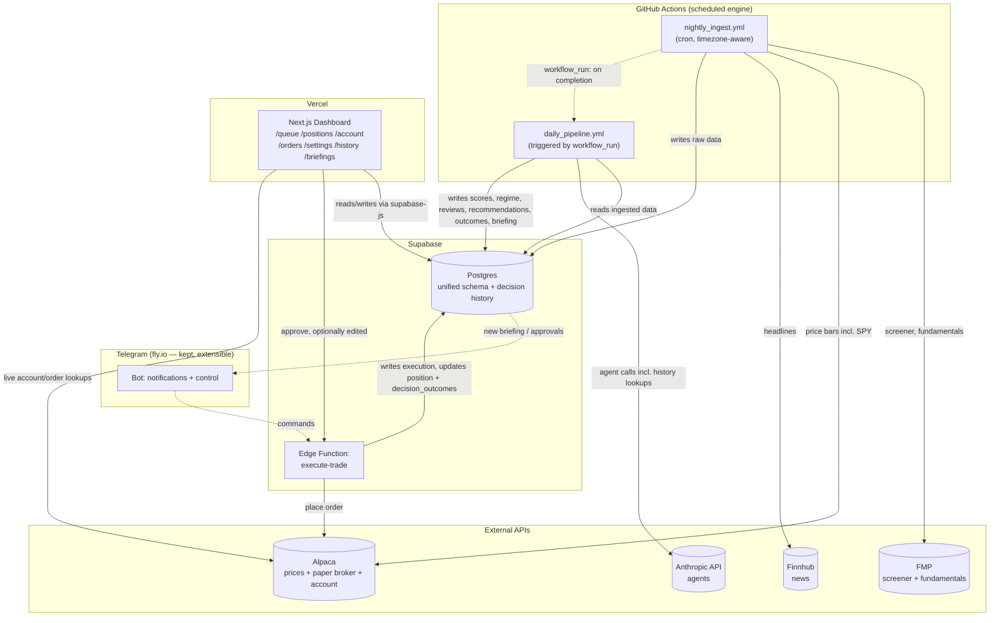
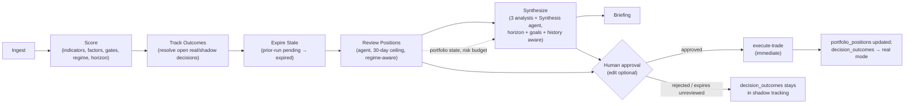

# Artisan v2 — Technical & Product Specification

## Status: Full rewrite — design spec, pre-implementation
## Supersedes: v1 `specs.md` (Phase 0 POC). This document stands alone; no v1 decision carries forward unless explicitly restated here.

**Revision 2 — changes from the first draft:** market regime and open-position trend elevated into the product vision and made a first-class input throughout; a full configuration interface for every tunable parameter; a trade decision knowledge base (reasoning, expectations, actual results — including for recommendations you didn't take) as a mandatory Phase 0 component that agents are required to consult; automatic expiry of unreviewed recommendations so you only ever see fresh input; performance goals and risk thresholds now directly drive the expected trade horizon; an account/execution/order-history interface with edit-before-send; max holding period reduced to 30 days and reflected through the timing logic; Telegram bot kept as a first-class, extensible component; several previously-open questions settled per your input.

**Revision 3 — this pass:** performance goals set — `target_annual_return_pct = 30%`, `max_drawdown_tolerance_pct = 10%` (§5.3, §11.2, §13) — no longer placeholders; all downstream references (horizon multiplier, drawdown-breach veto, config table, open questions) updated to match.

**Revision 4 — this pass:** added §2.6 (prompt storage/versioning convention) and a companion file, `artisan-v2-agent-prompts.md`, with full draft system prompts for all six agents.

**Revision 5 — this pass:** performance goals recalibrated — `target_annual_return_pct = 25%`, `max_drawdown_tolerance_pct = 18%` (was 30%/10%) — after flagging the original pairing's ~3.0 Calmar ratio as aggressive relative to what systematic equity strategies typically sustain. All downstream references updated, including the two agent prompts that cite these figures directly rather than as placeholders.

---

## 0. Document Purpose & How To Use This

This is an implementation-ready spec for a full rewrite of Artisan: an AI-agent-assisted equity swing-trading system that reads the market regime, screens and shortlists candidates, analyzes them across fundamentals/technicals/sentiment, recommends trades with concrete entry/stop/target/size and an expected horizon, manages open positions daily, keeps a permanent record of every decision and how it played out, and executes only on your explicit approval (paper trading by default).

Hand this file to Claude Code section by section. Section 18 (Phasing) gives a recommended build order. Section 20 (Open Questions) lists the handful of things you should confirm or override — everything else here is a concrete, opinionated decision, not a menu.

### 0.1 Key Decisions & Assumptions (read this first)

| Decision | What I chose | Why |
|---|---|---|
| Execution substrate | Alpaca **paper trading** only, live trading is a later, separate decision | Unchanged |
| Trading style | Daily/swing cadence, one pipeline run per trading day, max 30-day holding period | Matches batch data cadence; horizon tightened per your instruction (§5) |
| Universe | US equities, NYSE/NASDAQ only | Unchanged |
| Hosting | Supabase + Vercel + GitHub Actions for the core loop. Legacy TypeScript engine and its fly.io service still fully retired. **Telegram bot + its fly.io service are kept as first-class, not demoted** | You want to extend the bot's functionality later — architecture keeps that door open from day one |
| Scoring | One unified pipeline (factors → gates → sentiment-as-modifier), now also regime- and horizon-aware | Unchanged principle, extended |
| AI role | Synthesis + Position Review, now required to consult a persistent decision history before finalizing a call | Expanded per this message |
| Risk defaults | Kept exactly as originally proposed (§11) | You confirmed: "leave your default risk assumptions as is" — but every one of them is now editable through §13's config interface, not hardcoded |
| Config surface | Every threshold used in decision-making lives in `strategies` config, editable via a dashboard settings page, versioned in `audit_log` | New, explicit requirement this revision |

---

## 1. Product Vision & Operating Principles

Artisan is a **decision-support and execution-assist system**, not an autonomous trader. Every trading day it should be able to answer, with evidence:

1. **What's the market regime right now** — does this environment favor taking new risk, or call for caution? This isn't background color; it actively changes how selective the system is and how much room a new trade gets (§5).
2. Of everything investable right now, what's structurally attractive? (fundamentals + cross-sectional ranking)
3. Of the attractive names, which ones have a valid technical entry today?
4. Does anything in the news change the picture?
5. **For every position I already hold, is the trend that got me in still intact, or has something changed?** — reviewed daily, not just at entry, and explicitly informed by the same regime read as new candidates.
6. Given all of the above **and** what I already hold **and** what's actually worked before in situations like this, what should I do next — enter, watch, trim, close, or adjust?

Operating principles, in priority order:

1. **You are never surprised by a trade.** Every order that touches the broker traces back to something you explicitly approved (or, for a narrow, purely risk-reducing exception, to a mechanical rule you approved in advance — §10.3).
2. **Numbers come from code, judgment comes from agents.** An LLM never computes a price, a share count, or a stop level.
3. **Existing positions shape new decisions.** Portfolio state and remaining risk budget are first-class inputs to every new-trade recommendation.
4. **Every recommendation is falsifiable and time-boxed.** A specific invalidation condition and an expected horizon, not a vibe and an open-ended hold.
5. **The system remembers.** Every decision, its reasoning, and what actually happened is retained and is required reading for the next similar decision — whether or not you acted on it.
6. **Being behind a goal is never a reason to take more risk.** Performance context can only ever pull the system toward more caution, never less (§5.4).
7. **You only ever review what's current.** Stale, unreviewed recommendations expire automatically rather than piling up or conflicting with fresher ones (§12.4).
8. **Everything is logged and replayable.**

---

## 2. AI & Agent Strategy

*(Unchanged from the first draft in its core reasoning — repeated briefly here for context; see §5 and §12 for what's new: agents are now regime-aware, horizon-aware, and required to consult decision history.)*

### 2.1 The core split: deterministic computation, agentic judgment

LLMs are unreliable at precise arithmetic and expensive relative to a formula, but very good at synthesizing qualitative, conflicting information into a defensible judgment call. The whole strategy follows from taking that seriously:

| Task | Deterministic (code) | Agentic (LLM) |
|---|---|---|
| Technical indicators, factor z-scores, ranking | ✅ | |
| Market regime classification | ✅ (§5.1) | |
| Setup **classification** (pullback/breakout/squeeze) | ✅ | |
| Effective horizon computation | ✅ (§5.2) | |
| Setup **quality read** / context | | ✅ |
| Confluence gate pass/fail, all vetoes | ✅ | |
| Position sizing, stop/target, trailing-stop ratchet | ✅ | |
| News sentiment aggregate (universe-wide) | ✅ (lexicon scorer) | |
| News materiality / catalyst / red-flag judgment | | ✅ |
| Reconciling conflicting F/T/S signals into a thesis | | ✅ |
| Conviction ranking (bounded by deterministic eligibility) | | ✅ |
| Consulting decision history before finalizing a call | | ✅ (required, §12.5) |
| "Does the original thesis still hold?" (open positions) | | ✅ |
| Recommendation/position-review expiry | ✅ (§12.4) | |
| Order placement | ✅ (never agentic, ever) | |

This mirrors current practice in both the research literature and production-minded open-source multi-agent trading systems: specialized analyst agents feeding a synthesis/risk layer with a hard approval gate before anything reaches a broker, and — in the more production-oriented projects — a deterministic, rule-based mode that runs with no LLM at all, with agent reasoning added strictly on top rather than replacing the math. I'm holding that as a hard rule here, not a suggestion.

### 2.2 Agent roster

| Agent | Model | Scope per run | Reads (now includes) | Writes |
|---|---|---|---|---|
| **Fundamental Analyst** | Haiku 4.5 | 1 call/shortlisted symbol (parallel) | `factor_scores`, `fundamentals`, + symbol-scoped decision history | `agent_analyses` |
| **Technical Analyst** | Haiku 4.5 | 1 call/shortlisted symbol (parallel) | `entry_signals` (incl. `effective_horizon_days`), `indicator_values`, market regime | `agent_analyses` |
| **Sentiment Analyst** | Haiku 4.5 | 1 call/shortlisted symbol (parallel) | `news_articles` raw text | `agent_analyses` |
| **Synthesis / Portfolio Manager** | Sonnet 5 | 1 call, whole shortlist + portfolio state | all of the above + market regime + performance-vs-goals + `decision_outcomes` history (required lookup, §12.5) | `recommendations` |
| **Position Review** | Sonnet 5 | 1 call, all open positions together | `portfolio_positions`, fresh scores/gates, market regime, original thesis, decision history for the symbol | `position_reviews` |
| **Daily Briefing** | Haiku 4.5 | 1 call | everything produced that run, incl. regime and any expirations | `briefings` |

### 2.3-2.5 Orchestration, cost, guardrails

Unchanged from the first draft: a typed pipeline (Pydantic I/O, tool use, forced JSON schema) rather than open-ended multi-agent debate, for reproducibility, cost predictability, and hallucination containment. Haiku 4.5 ($1/$5 per MTok) for the three per-symbol analysts and briefing, Sonnet 5 ($2/$10 through Aug 31 2026, then $3/$15) for Synthesis and Position Review, prompt caching on shared system context. Illustrative cost at a 30-symbol shortlist remains well under $1/day at list price. All six guardrails from the first draft still apply verbatim (no agent ever calls a broker; deterministic pre-filters bound what's ENTER-eligible and agents can only downgrade, never upgrade; all numeric fields are code-computed; structured output only; full audit log; a daily cost cap, now itself configurable per §13).

**One addition to the guardrails**: every Synthesis and Position Review output must include a `historical_precedent` field — a short, mandatory note on whether relevant decision history existed for this symbol/setup/regime combination and how it factored into the call (or an explicit "no relevant precedent found" if none existed). This isn't optional color; it's how you verify the agent is actually using §12's knowledge base rather than just having it available.

### 2.6 Prompt storage, structure, and versioning

Every agent's system prompt is a versioned artifact, not a string embedded inline in code — that's what `prompt_version` is for, already logged on every `agent_analyses`, `recommendations`, and `position_reviews` row (§4). Store each prompt as its own file under `engine/artisan/agents/prompts/` (e.g. `fundamental_analyst.md`), loaded at runtime and referenced by that version string, so a prompt edit is a reviewable diff, not a silent behavior change buried in application code.

Full draft prompts for all six agents — structured consistently (role, exact input contract, available tools, required reasoning steps, hard constraints restating the relevant guardrails above, and a forced-tool-call output schema) — are in the companion file `artisan-v2-agent-prompts.md`. Treat them as complete, carefully-structured first drafts consistent with every schema and constraint in this spec, not as empirically tuned prompts — that tuning only happens once they're run against real shortlist data and real edge cases, and these should be expected to iterate faster than anything else in this spec.

---

## 3. System Architecture

### 3.1 High-level architecture



### 3.2 Services & hosting

| Service | Platform | Responsibility | Note |
|---|---|---|---|
| Engine (single, Python) | GitHub Actions | All ingest, scoring, regime/horizon computation, agent orchestration, outcome tracking | |
| Database | Supabase (Postgres) | Unified schema incl. decision history | |
| Execution trigger | Supabase Edge Function | Places orders on approval, immediately, accepts optional edits (§17) | |
| Frontend | Vercel (Next.js) | Dashboard, queues, account/orders, settings, history browser | Expanded this revision — §16 |
| **Telegram bot** | **fly.io, kept as first-class** | Push notifications now; the architecture (DB access, Edge Function hooks) is deliberately built so richer interactive commands can be added later without a re-architecture | **Not demoted** — you want to grow this |
| Broker | Alpaca (paper) | Prices, execution, account/order data | |
| Fundamentals/screener | FMP | | |
| News | Finnhub | | |
| LLM | Anthropic API | All agent calls | |

### 3.3 Jobs & workflows

Two GitHub Actions workflows, chained by completion (`workflow_run`) rather than by assuming a time gap between two independent crons — GitHub's own scheduling isn't precisely timed, so completion-chaining removes that risk entirely. Both support `workflow_dispatch` for manual reruns.

**`nightly_ingest.yml`** — unchanged: `fmp_screener` → `fmp_fundamentals` → `alpaca_prices` (incl. `SPY`) → `finnhub_news`. Pure data collection, no scoring, no LLM calls.

**`daily_pipeline.yml`** — now six ordered steps (`needs:` between jobs within one workflow), Mon-Fri:

1. **`score`** — indicators, factor z-scores, gates, **market regime classification**, **effective horizon per setup type** (§5)
2. **`track_outcomes`** — resolves every open `decision_outcomes` row (real *and* shadow) against fresh price data: has anything hit its target, stop, or time horizon since yesterday? Pure code, no LLM (§12.3)
3. **`expire_stale`** — any `recommendations` or `position_reviews` still `status=pending` from a prior run become `status=expired` (§12.4). This is queue hygiene only; it does not touch `decision_outcomes`, which has already been tracking that row since it was created
4. **`review_positions`** — Position Review agent, now regime-aware, 30-day hard ceiling, mechanical stop-tightening auto-applies
5. **`synthesize`** — three analyst agents + Synthesis agent; every new recommendation gets a `decision_outcomes` row in shadow mode at creation
6. **`briefing`**

**`execute-trade`** (Supabase Edge Function, on-demand) — fires the instant you approve, optionally with edits (§17). Re-validates against current risk limits, places the order, writes `trade_executions`, updates `portfolio_positions`, and flips the corresponding `decision_outcomes` row from shadow to real tracking mode using the actual fill price.

### 3.4 Data flow — daily pipeline sequence



---

## 4. Data Model (unified schema)

New or materially changed tables/columns vs. the first draft are marked **NEW**.

| Table | Purpose | Key columns |
|---|---|---|
| **`pipeline_runs`** **NEW** | One row per daily pipeline execution — the anchor for every `run_id` referenced elsewhere | `id`, `run_date`, `status`, `market_regime`, `started_at`, `completed_at` |
| `strategies` | Strategy config — now the single source of truth for every tunable parameter (§13) | `id`, `name`, `is_active`, `risk_params` (jsonb), `screening_params` (jsonb), `timing_params` (jsonb), `position_mgmt_params` (jsonb), **`performance_goals`** (jsonb) **NEW** |
| `assets` | Symbol metadata | `symbol`, `sector`, `industry`, `exchange`, `name` |
| `universes` | Screened universe membership | `symbol`, `strategy_id`, `active`, `screened_at`, `exclusion_reason` |
| `price_bars` | Daily OHLCV, incl. `SPY` | `symbol`, `date`, OHLCV |
| `fundamentals` | Annual fundamentals history | as in §6 |
| `news_articles` | Finnhub headlines | `symbol`, `published_at`, `headline`, `summary`, `lexicon_score` |
| `indicator_values` | Computed technicals | `rsi_14`, `macd_hist`, `atr_14`, `sma_50/200`, `adx_14`, `obv`, `vol_ratio`, `bb_width`, `rs_vs_spy` |
| **`regime_snapshots`** **NEW** | One row per run, the regime classification and its inputs | `run_id`, `date`, `regime` (risk_on/neutral/risk_off), `spy_vs_sma`, `spy_vol_percentile`, `spy_drawdown_from_high_pct` |
| `factor_scores` | Cross-sectional shortlisting layer | as before |
| `entry_signals` | Technical timing layer | as before, plus **`effective_horizon_days`** **NEW** |
| `agent_analyses` | Per-pillar agent output | `run_id`, `symbol`, `agent_type`, `output` (jsonb) |
| `recommendations` | New-trade queue | as before, `status` now includes **`expired`** **NEW**, plus **`effective_horizon_days`**, **`historical_precedent`** **NEW** |
| `portfolio_positions` | Open positions | as before |
| `position_reviews` | Daily position verdicts | as before, `status` now includes **`expired`** **NEW**, plus **`historical_precedent`** **NEW** |
| **`decision_outcomes`** **NEW** | The knowledge base — every trade decision, its stated expectation, and its actual/hypothetical resolution (§12) | `id`, `source_type` (recommendation/position_review), `source_id`, `symbol`, `mode` (shadow/real), `entry_price_reference`, `stop_price`, `target_price`, `effective_horizon_days`, `resolution`, `resolved_at`, `days_to_resolution`, `r_multiple`, `created_at`, `updated_at` |
| `trade_intents` | Approved, execution-ready orders | as before, plus **`overrides`** (jsonb, edited shares/stop/target if any) **NEW** |
| `trade_executions` | Actual fills | as before |
| `portfolio_snapshots` | Daily equity/exposure tracking | `date`, `equity`, `open_risk_pct`, `sector_exposure` (jsonb), `drawdown_from_high_pct` |
| `audit_log` | Every pipeline/agent/config-change action | `id`, `run_id`, `action_type`, `payload` (jsonb), `created_at` |

---

## 5. Market Regime & Performance-Driven Horizon

New section this revision — the mechanism that makes market conditions and your performance/risk goals *actual inputs to decisions*, not just displayed context.

### 5.1 Market regime classification (deterministic, once per run)

Computed in the `score` step from `SPY` data only, stored on `regime_snapshots`, referenced by everything downstream.

- **`risk_on`**: `SPY close > SMA50 > SMA200`, `SMA200` slope positive, `SPY ADX_14 > 15`, 20-day annualized realized vol below its own trailing 252-day median, and `SPY` within 5% of its 252-day high.
- **`risk_off`**: `SPY close < SMA200`, **or** 20-day realized vol above its trailing 252-day 80th percentile, **or** `SPY` more than 10% below its 252-day high.
- **`neutral`**: everything else.

Defaults to backtest and tune, like the setup-detection thresholds in §7.3 — this is a first cut, not a claimed-optimal rule.

**Effect on eligibility (§9.2):** the ENTER-eligibility rank threshold tightens as regime worsens — top-decile in `risk_on`, top-5% in `neutral`. `risk_off` doesn't block new entries outright (that would hide genuinely exceptional setups from you), but eligibility narrows to the top 2-3 ranked names with every gate cleanly passing, no near-misses.

### 5.2 Effective horizon per recommendation

```
effective_horizon_days = min(
    baseline(setup_type) × regime_multiplier × performance_multiplier,
    max_holding_period_days   # hard ceiling = 30 (§10.1)
)
```

- **Baseline by setup type** (defaults, tunable): `pullback` 20 trading days, `breakout` 15 days, `squeeze` 10 days to trigger (then the breakout baseline takes over).
- **Regime multiplier**: `risk_on` ×1.0, `neutral` ×0.85, `risk_off` ×0.65 — worse conditions get less rope.
- **Performance multiplier**: 1.0 by default; drops to ×0.8 if current portfolio drawdown-from-equity-high has reached at least half the distance to `max_drawdown_tolerance_pct` — with tolerance set at 18% (§5.3), that means a 9% drawdown from the equity high is enough to tighten every new horizon (§5.4). **This multiplier is capped at 1.0 — it can only tighten the horizon, never loosen it, regardless of how far ahead of target performance is running.**

Computed in `score`, stored on `entry_signals`, copied onto `recommendations` and `decision_outcomes` at creation for a stable historical record. It becomes an explicit, observable invalidation condition: "no meaningful progress toward target by day `effective_horizon_days`" is something Position Review is required to weigh, and no position may be held past the hard 30-day ceiling regardless of setup type, regime, or agent opinion.

### 5.3 Performance goals

`strategies.performance_goals`: `target_annual_return_pct = 25%`, `max_drawdown_tolerance_pct = 18%`, `benchmark_symbol` (`SPY`) — recalibrated from the original 30%/10% pairing after review.

25% annual against an 18% maximum drawdown implies a Calmar ratio (return ÷ max drawdown) of about 1.4 — a meaningfully more realistic combination than the original pairing (Calmar ≈ 3), and one that sits within the range robust systematic equity strategies have actually sustained over full market cycles rather than requiring near-flawless execution. The 18% figure also carries real buffer above `max_portfolio_heat_pct` (8%, §11.2) — the sum of stated risk across every simultaneously open position — leaving room for the normal gap between planned risk and what actually gets realized in a rough stretch (slippage, overnight gaps through stops, positions that are nominally uncorrelated moving together anyway) before the halt in §5.4 triggers. As before: this isn't a number the system will ever try to force by taking on more risk — per the hard rule in §5.4, running behind 25% is never a reason to loosen anything, and none of this changes what the halt actually does once triggered (pause new entries, flag positions, never auto-liquidate).

### 5.4 How performance goals actually change behavior — and the one hard rule

Synthesis receives current trailing performance vs. `target_annual_return_pct` and current drawdown vs. `max_drawdown_tolerance_pct` as explicit context every run. This can move the system in exactly one direction:

- **Approaching or breaching `max_drawdown_tolerance_pct`** tightens the horizon multiplier (§5.2) and, at full breach, triggers the same halt behavior as the daily kill switch (§11.2): new entries and pending approvals are paused, all open positions are flagged for urgent review, **nothing is auto-liquidated** — closing positions is still your call.
- **Running ahead of `target_annual_return_pct`, or well within drawdown tolerance, does not loosen anything.** No increased position size, no lowered conviction bar, no widened risk limits, ever, on the basis of being ahead of a target. The hard caps in §11 are not performance-adjustable in that direction. This is deliberate: "we're behind, let's take more risk to catch up" is exactly the failure mode this rule exists to prevent, and there's no legitimate symmetric case for "we're ahead, let's take more risk because we can afford to" either — the caps in §11 already represent the risk you decided you're willing to carry.

---

## 6. Business Logic — Universe & Shortlisting (Fundamentals-driven)

Unchanged from the first draft. Funnel: FMP screener → hard filters (`FCF > 0`, `net_debt/EBITDA < 4`) → sector-neutral 5-factor scoring (Value 25% / Quality 25% / Momentum 25% / Low Vol 10% / Growth 15%) → rank → **top 30 by `composite_z`** = the daily shortlist. (Confirmed this revision — was previously a default, now settled.) Full factor formulas as specified in the first draft; unchanged, so not repeated here in full — see the original component list (`EarningsYield`, `BookYield`, `SalesYield`, `FCFYield`, `EBITDAYield` for Value; `GrossProfitability`, `ROA`, `ROE`, `CashFlowMargin`, `Accruals`, `Leverage`, `InterestCoverage`, `NetDebtToEBITDA` for Quality; `Mom_12_1` for Momentum; `RealizedVol_252` and `Beta_60m` for Low Vol; 3-year CAGR growth metrics for Growth), all sector-neutral z-scored and winsorized as before.

This layer answers only "is this structurally a good business at a reasonable price" — nothing about timing. That's §7.

---

## 7. Business Logic — Trend & Entry Timing (Technical)

Runs on the 30-name shortlist only.

### 7.1 Gate model

- **Gate 0 — Market regime**: now reads `regime_snapshots` directly rather than an ad hoc SPY check (§5.1); global, applies to every symbol in the run.
- **Gate 1 — Trend**: `close > SMA200`, `SMA50 > SMA200`, `SMA200` slope positive, `ADX_14 > 20`.
- **Gate 2 — Setup**: `pullback` / `breakout` / `squeeze` / `null` (detection rules unchanged, §7.3).
- **Gate 3 — Confirmation**: `RSI_14 < 70`, `MACD` histogram rising, `vol_ratio` confirms, `OBV` rising, `RS_vs_SPY` rising.
- **Gate 4 — Risk levels**: ATR-based entry/stop/target/R (§11.3).
- **Gate 5 — Sizing**: from strategy sizing rules (§11.1).

### 7.2 `trend_score` and `effective_horizon_days`

`actionable` (bool, all gates pass) and `trend_score` (0-1, continuous, for ranking near-misses) as in the first draft. This step also computes `effective_horizon_days` per §5.2, since `setup_type` — the input to the horizon baseline — is determined right here.

### 7.3 Setup detection (unchanged from first draft)

- **Pullback**: uptrend intact (`close > SMA200`, `close > SMA50` within the last 10 bars), price now within 2% of `SMA50` or between `SMA20`/`SMA50`, `RSI_14` 35-55, 5-bar low hasn't closed below `SMA200`.
- **Breakout**: `close > max(high[t-21:t-1])`, `vol_ratio > 1.5`, `bb_width` percentile was below the 40th percentile on the prior bar.
- **Squeeze**: `bb_width` in the bottom decile (trailing 120 bars), `ADX_14 < 20`, tight 10-day realized range.

All thresholds tunable, per the first draft.

### 7.4 Indicators

`adx_14`, `obv`, `vol_ratio`, `rs_vs_spy` — unchanged from the first draft; `rs_vs_spy` remains a short-horizon timing signal, distinct from the 12-month `Momentum` structural factor in §6, and distinct again from the 30-day trade horizon introduced in §5 — three different time dimensions, not to be conflated.

---

## 8. Business Logic — Sentiment Analysis

Unchanged from the first draft: a cheap universe-wide lexicon score at ingest (triage only, never a trigger), and the real analysis done by the Sentiment Analyst agent reading actual headlines for the shortlist, returning `sentiment_direction`, `materiality`, `catalysts_identified`, `red_flags`. Sentiment remains a modifier/veto on top of a fundamentals+technicals case, never a primary trigger.

---

## 9. Business Logic — Balanced Trade Recommendation (Synthesis)

### 9.1 What "balanced" means

Unchanged principle: no single pillar unilaterally triggers a recommendation. A name must clear a deterministic confluence bar before the agent considers it for ENTER; sentiment acts only as a modifier on top.

### 9.2 Eligibility (deterministic, regime-aware per §5.1)

ENTER-eligible requires: `hard_filter_pass = true`, `entry_signals.actionable = true`, no active veto (§9.3), and a factor-rank threshold that now depends on regime — top-decile in `risk_on`, top-5% in `neutral`, top 2-3 with zero near-miss gates in `risk_off`. Everything else on the shortlist is WATCH-eligible only.

### 9.3 Veto rules

Unchanged set, one addition:

- `earnings_blackout`: **confirmed asymmetric, −3 trading days before through +1 trading day after** a known earnings date.
- `sector_cap_breach`, `risk_budget_exhausted` (`available_risk_budget <= 0`, no exceptions), `liquidity`, `correlation_breach`, `sentiment_red_flag` — all as in the first draft.
- **`drawdown_tolerance_breach`** **NEW**: portfolio drawdown-from-high has reached `max_drawdown_tolerance_pct` (18%) — same halt behavior as the daily kill switch (§5.4, §11.2).

### 9.4 Synthesis process

Same five-step process as the first draft (deterministic filtering → agent conviction across the eligible set → thesis + invalidation conditions → code-computed sizing → capped daily output), with three additions:

1. The agent receives market regime, performance-vs-goals context, and `effective_horizon_days` per candidate as required inputs, not optional color.
2. Before finalizing conviction on any symbol, the agent **must** query `decision_outcomes` (§12.5) for that symbol and for its setup-type/regime combination, and populate `historical_precedent` with what it found and how it weighed it — including an explicit "no relevant history" if none exists.
3. **Output is capped at the top 8-10 recommendations per day** — confirmed this revision as the standing default, not just a placeholder.

---

## 10. Business Logic — Open Position Review & Portfolio Management

### 10.1 Max holding period — reduced to 30 days

`max_holding_period_days = 30` (was 60). This is a **hard ceiling**, and it now shapes trade selection itself, not just a late flag on positions that overstayed: every setup's `effective_horizon_days` (§5.2) is computed to comfortably resolve inside this window (baselines of 10-20 days plus regime/performance tightening, never the reverse), so the strategy is, by construction, looking for opportunities that can plausibly play out within 30 days rather than open-ended holds that happen to get capped late. A position hitting the 30-day ceiling without resolving is flagged for review, not silently extended.

### 10.2 Deterministic pre-checks

- **Trailing stop ratchet — confirmed fully automatic**, no approval step: once unrealized gain reaches +1R, stop moves to breakeven; beyond that, trails at `current_price − 2×ATR_14`, ratcheting up only, never down. Because this can only ever reduce risk, it applies without waiting on you.
- Max holding period flag (30 days, above), position weight drift, earnings proximity — unchanged logic from the first draft.

### 10.3 Position Review agent

Unchanged responsibilities (HOLD/TRIM/ADD/CLOSE/TIGHTEN_STOP/WIDEN_TARGET, batched across all open positions, Sonnet 5), now additionally required to weigh: current market regime (a regime shift to `risk_off` is itself a reason to reassess even technically-fine positions), whether the position is approaching `effective_horizon_days` with no progress, and — same as Synthesis — required to consult `decision_outcomes` history for the symbol and populate `historical_precedent`.

Guardrail unchanged: CLOSE/TRIM/TIGHTEN move freely (risk-reducing); ADD or any stop-loosening is clamped against the portfolio risk budget in code before you ever see it.

### 10.4 Feed-forward into new-trade synthesis

Unchanged mechanism from the first draft: `available_risk_budget = max_portfolio_heat_pct − Σ(dollar_risk of open positions, post-review)`, computed after Position Review and consumed directly by Synthesis — no new ENTER recommendation is generated once it's exhausted, regardless of candidate quality.

---

## 11. Risk Controls & Position Sizing

Defaults kept exactly as originally proposed, per your instruction — every one of them is now editable via §13, not hardcoded.

### 11.1 Position sizing (risk-based, unchanged formula)

```
dollar_risk_per_trade = equity × risk_per_trade_pct        # default 1%
shares_by_risk = floor(dollar_risk_per_trade / (entry_price − stop_price))
shares_by_cap  = floor((equity × max_position_pct) / entry_price)   # default cap 10%
final_shares   = min(shares_by_risk, shares_by_cap)
```

### 11.2 Portfolio-level limits

| Parameter | Default | Enforcement |
|---|---|---|
| `risk_per_trade_pct` | 1% of equity | Sizing formula |
| `max_position_pct` | 10% of equity | Sizing formula |
| `max_concurrent_positions` | 15 | Hard veto |
| `max_sector_exposure_pct` | 25% of equity | Hard veto |
| `max_portfolio_heat_pct` | 8% of equity | Hard veto via `available_risk_budget` |
| `daily_drawdown_kill_switch_pct` | −3% in a session | Halts new entries, flags positions, no auto-liquidation |
| **`max_drawdown_tolerance_pct`** | **18%**, confirmed (§5.3) | Same halt behavior, longer-horizon trigger |

### 11.3 Stop/target

Unchanged: stop `entry − 2×ATR_14`, target `entry + 3×ATR_14` at entry, both code-computed; trailing per §10.2 once profitable.

---

## 12. Knowledge Base — Trade Decision History & Outcome Tracking

New this revision, and explicitly Phase 0, not deferred. This is the direct answer to "record decisions, reasoning, expectations, and actual results, including recommendations that weren't accepted, so agents can use this history when making future recommendations."

### 12.1 What gets recorded

Every `recommendation` your agents produce — approved, rejected, or left to expire — gets a `decision_outcomes` row the moment it's created. Nothing is recorded only in hindsight; the expectation is captured at decision time, before anyone knows the outcome, which is what makes the later comparison meaningful.

- `entry_price_reference`, `stop_price`, `target_price`, `effective_horizon_days` — the stated expectation, snapshotted at creation so it stays stable even if the source recommendation is later edited.
- `mode`: `shadow` at creation. Flips to `real` only if/when the recommendation is approved and actually executed — at that point `entry_price_reference` is replaced with the real fill price.
- The full thesis, reasoning, and `historical_precedent` note live on the source `recommendations`/`position_reviews` row and are joined via `source_id` — not duplicated.

### 12.2 Tracking recommendations you didn't take

This is the part that directly answers "track those which were not accepted, and the expected performance." A rejected or expired recommendation's `decision_outcomes` row simply **stays in `shadow` mode** and keeps getting updated by `track_outcomes` (§12.3) exactly like a real position would — did the symbol go on to hit the stated target, the stated stop, or run out the horizon, as if you'd taken it? This gives you (and your agents) a genuine, ongoing comparison: of everything recommended, what fraction of the *accepted* ideas worked versus what fraction of the *declined* ideas would have worked. That comparison is often the most useful thing in the whole system for calibrating whether your own override instincts, or the agents' conviction calls, are the ones adding value.

### 12.3 Resolution — `track_outcomes` (deterministic, daily)

For every `decision_outcomes` row not yet resolved (real or shadow), check fresh price data:

- `hit_target` / `hit_stop` — price crossed the stated level
- `time_expired_favorable` / `time_expired_unfavorable` / `time_expired_flat` — `effective_horizon_days` elapsed without hitting either, resolved by whether it's currently sitting above/below/at entry
- `superseded` — a real position that Position Review closed early, before target/stop/horizon
- `still_open` — none of the above yet

Pure code, no LLM, cheap, runs every trading day against data already ingested.

### 12.4 Recommendation expiry (queue hygiene, separate from outcome tracking)

Any `recommendations` or `position_reviews` row still `status=pending` when the next `daily_pipeline` run reaches the `expire_stale` step becomes `status=expired`. This is purely about what you see in the review queues — it guarantees you only ever review the freshest run's output, and that two days' worth of recommendations for the same symbol (possibly with different numbers, since price moved) never sit side by side. It does **not** interrupt outcome tracking, which was already running in shadow mode from the moment the recommendation was created and simply continues.

### 12.5 How agents actually use this (required, not optional)

Both Synthesis and Position Review have a `query_decision_history` tool — `(symbol?, setup_type?, regime?, limit)` → aggregate stats (win rate, average R-multiple, average days-to-resolution, count, split by real vs. shadow) plus the most recent individual records. Their system prompts **require** a lookup before finalizing any call, and their output schema requires the `historical_precedent` field (§2.5) describing what was found and how it was weighed. The three per-symbol analysts get a narrower, symbol-only version of the same tool, so a fundamental or technical read can note "we've flagged this name before and the thesis didn't hold because X" where relevant.

This mechanism also quietly resolves a related edge case: if a symbol was recommended yesterday and expired unreviewed, and today's run wants to recommend it again, Synthesis will surface that prior expired recommendation through the same history lookup — so a repeat idea reads as a repeat idea, not a fresh one, without needing special-case logic.

*(The same `source_type`/`source_id` pattern extends naturally to `position_review` CLOSE/TRIM decisions — tracking the "what if we'd held" counterfactual — which is worth enabling once the core recommendation-tracking loop above is running, but isn't required to ship Phase 0.)*

---

## 13. Configuration Interface

New this revision: every threshold used anywhere in this document is a row in `strategies` config, editable from a dashboard settings page (`/settings`), not a hardcoded constant. Every change writes an `audit_log` entry (old value, new value, who, when) — risk-parameter changes are exactly the kind of thing that deserves a paper trail. Changes take effect on the next pipeline run; because every run's recommendations expire and regenerate fresh (§12.4), there's no mid-flight inconsistency to worry about.

Suggested grouping for the settings UI, and the master list of everything configurable:

| Group | Parameter | Default | Defined in |
|---|---|---|---|
| **Risk & sizing** | `risk_per_trade_pct` | 1% | §11.1 |
| | `max_position_pct` | 10% | §11.1 |
| | `max_concurrent_positions` | 15 | §11.2 |
| | `max_sector_exposure_pct` | 25% | §11.2 |
| | `max_portfolio_heat_pct` | 8% | §11.2 |
| | `daily_drawdown_kill_switch_pct` | −3% | §11.2 |
| | `max_drawdown_tolerance_pct` | **18%**, confirmed | §5.3, §11.2 |
| **Screening & shortlisting** | `shortlist_size` | 30 | §6 |
| | `daily_recommendation_cap` | 8-10 | §9.4 |
| | `factor_weights` (Value/Quality/Momentum/LowVol/Growth) | 25/25/25/10/15 | §6 — marked "advanced," changes ranking philosophy |
| **Timing & horizon** | `max_holding_period_days` | 30 | §10.1 |
| | `horizon_baseline_days` (per setup type) | pullback 20 / breakout 15 / squeeze 10 | §5.2 |
| | `regime_multipliers` | risk_on 1.0 / neutral 0.85 / risk_off 0.65 | §5.2 |
| | `earnings_blackout_pre_days` / `_post_days` | 3 / 1 | §9.3 |
| **Position management** | `trailing_stop_atr_multiple` | 2 | §10.2 |
| | `breakeven_trigger_r` | 1 | §10.2 |
| | `auto_apply_stop_tightening` | **true** | §10.2 — confirmed fully automatic |
| **Performance goals** | `target_annual_return_pct` | **25%**, confirmed | §5.3 |
| | `benchmark_symbol` | `SPY` | §5.3 |
| **Cost control** | `llm_daily_cost_cap_usd` | generous default given §2.4's actual cost | §2.5 |

Every numeric field gets a sane min/max bound in code (e.g., `risk_per_trade_pct` can't be set to 50%) so a fat-fingered edit can't silently create an unreasonable risk configuration — validation happens before the row is saved, not just at decision time.

---

## 14. External Integrations

Unchanged from the first draft:

| Provider | Purpose | Tier | Notes |
|---|---|---|---|
| **FMP** | Screener, fundamentals | Paid (Starter/Premium+) | Free/Basic is a 250-calls/day EOD sandbox; screener access needs at least Starter. Confirm current $ pricing directly — aggregators disagree. |
| **Alpaca** | Prices, paper broker, account/orders | Free (IEX) to start | Free plan: real-time IEX-only data + paper trading at $0/month; Algo Trader Plus ($99/month) adds full SIP consolidated-tape data. |
| **Finnhub** | News headlines | Free to start | ~60 calls/minute free, no card required — sufficient for a 30-symbol shortlist. |
| **Anthropic** | Agent calls | Pay-as-you-go | Haiku 4.5 $1/$5, Sonnet 5 $2/$10 through Aug 31 2026 then $3/$15. |

---

## 15. Environment & Configuration

Note: most of what used to be an env var is now a `strategies` config row editable via §13 instead — env vars remain only for secrets/credentials and truly deployment-level settings, not decision-making thresholds.

| Variable | Used by |
|---|---|
| `SUPABASE_URL`, `SUPABASE_SERVICE_ROLE_KEY` | engine, edge functions |
| `NEXT_PUBLIC_SUPABASE_URL`, `NEXT_PUBLIC_SUPABASE_ANON_KEY` | frontend |
| `ALPACA_API_KEY`, `ALPACA_API_SECRET`, `ALPACA_BASE_URL` | engine, edge function |
| `FMP_API_KEY` | ingest |
| `FINNHUB_API_KEY` | ingest |
| `ANTHROPIC_API_KEY` | agents |
| `ADMIN_USER_ID` | approval routes |
| `TELEGRAM_BOT_TOKEN`, `TELEGRAM_CHAT_ID` | bot (kept, first-class) |

---

## 16. Account, Execution & Order Management Interface

New section this revision. Frontend pages, beyond what already existed conceptually:

| Page | Purpose | Data source |
|---|---|---|
| **`/queue`** | Recommendations + position actions awaiting approval, **with edit-before-execute** | `recommendations`, `position_reviews` |
| **`/positions`** | Open positions: live unrealized P/L, R-multiple-to-date, days held, distance to stop/target, latest Position Review verdict inline | `portfolio_positions` + live Alpaca prices |
| **`/account`** **NEW** | Account details — equity, cash, buying power — and account-level performance: equity curve vs. `SPY`, drawdown, realized win rate and average R-multiple | Live Alpaca account endpoint + `portfolio_snapshots` + `decision_outcomes` (real mode only) |
| **`/orders`** **NEW** | Full order history: what was recommended, what was actually sent (flagging any edits), what filled, and the eventual outcome | `trade_executions` joined with `trade_intents`, `recommendations` |
| **`/history`** **NEW** | Browsable decision knowledge base — every past recommendation (taken or not), its thesis, expected vs. actual outcome, filterable by symbol/setup/regime/result | `decision_outcomes` joined with `recommendations`/`position_reviews` |
| `/strategy` | Shortlist, factor ranks, timing gates — the "why is this even a candidate" view | `factor_scores`, `entry_signals` |
| **`/settings`** **NEW** | Configuration interface (§13) | `strategies` |
| `/briefings` | Daily digest | `briefings` |

### 16.1 Execute-with-edit contract

The `execute-trade` Edge Function's contract is extended to accept an optional override payload: `{trade_intent_id, overrides?: {shares?, stop_price?, target_price?}}`. In Phase 0, order type stays market-only (limit orders remain Phase 1, per the original spec) and symbol/side aren't editable — only the numbers are. Any override is re-validated against the risk formulas in §11.1 and the portfolio limits in §11.2 **before** the order is allowed to submit; an edit that would breach a hard cap is rejected with a clear message, not silently clamped and not silently allowed. This is the same re-validation step that already runs on unedited approvals, extended to cover the edited-value case.

---

## 17. Approval & Execution Flow

```
1. Dashboard shows two queues: "New Recommendations" and "Position Actions"
   — only the current run's items; anything older already expired (§12.4)
2. You approve as-is, approve with edits, or reject each item
3. On approve → immediately invokes execute-trade (§16.1), does not wait for
   the next scheduled pipeline run
4. Edge Function re-validates (incl. any edits) against current risk limits,
   places the order, writes trade_executions, updates portfolio_positions,
   flips the matching decision_outcomes row to real mode
5. On reject, or if left unreviewed until expiry → decision_outcomes stays
   in shadow mode and continues tracking exactly as if it were a live idea
```

Mechanical, purely risk-reducing position actions (trailing stop tightening) skip approval entirely per §10.2 — everything else always waits for you.

---

## 18. Phasing / Build Order

1. **Schema + config** — unified schema (§4), `strategies` seed row with §11/§13 defaults, `pipeline_runs`
2. **Ingest** — unchanged from first draft
3. **Score (deterministic only)** — indicators, factor model, gates, **regime classification, horizon computation** — still fully testable with zero LLM calls
4. **Risk/sizing module** — unit-testable in isolation
5. **Knowledge base plumbing** — `decision_outcomes` schema + `track_outcomes` + `expire_stale`; build this *before* wiring in agents, so the history-lookup tool has something real to query once agents arrive, and so shadow-tracking is running from day one rather than retrofitted
6. **Agents** — Position Review and Synthesis stubbed against real scoring + regime + knowledge-base output before wiring in the three per-symbol analysts; validate structured-output schemas, including the mandatory `historical_precedent` field, early. Start from the draft prompts in `artisan-v2-agent-prompts.md` (§2.6) but expect to iterate wording against real outputs before trusting any of them
7. **Approval queues + execution**, including the edit-before-execute path (§16.1)
8. **Account / orders / history / settings pages** (§16, §13)
9. **Briefing**
10. **Telegram bot** — push notifications first; the architecture already supports extending to interactive commands whenever you're ready, without revisiting the core design

Risk controls (§11) remain Phase 0, not deferred, unchanged from the first draft's reasoning.

---

## 19. Explicit Deltas From v1

Unchanged table from the first draft (dual engines → one engine, dual scoring → unified, narrator-only LLM → real synthesis, no position review → daily review, delayed execution → immediate, deferred risk controls → Phase 0, undefined setups → concrete rules, flat sizing → risk-based sizing, racing crons → chained workflows, planned FinBERT → skipped). This revision adds:

| v1 | v2 |
|---|---|
| No decision history; each run reasoned from scratch | Persistent knowledge base, mandatory agent consultation before every recommendation (§12) |
| Recommendations could accumulate indefinitely if unreviewed | Automatic expiry every run; only the freshest inputs are ever shown (§12.4) |
| 60-day max holding period, setup selection not horizon-aware | 30-day hard ceiling; setups and their baselines are chosen to resolve well inside it (§5.2, §10.1) |
| No market regime concept beyond a Gate 0 boolean | Regime is a 3-state classification, part of the product vision, and actively tightens eligibility and horizon as conditions worsen (§5) |
| No config UI — thresholds were env vars or code constants | Every decision-making parameter is a dashboard-editable, audited config row (§13) |
| No account/order-history views specified | `/account`, `/orders`, `/history` with live broker data and edit-before-execute (§16) |

---

## 20. Open Questions For You

Most of the first draft's open questions are now settled per your input (earnings blackout, auto-apply threshold, shortlist size/cap, risk defaults, Telegram bot, performance goals — 25% target return / 18% drawdown tolerance). What's left:

- [ ] `horizon_baseline_days` and `regime_multipliers` (§5.2) — proposed defaults, meaningfully backtestable once there's trade history; worth revisiting after the first few weeks of paper trading rather than treating as final.
- [ ] `regime_snapshots` thresholds (§5.1) — same status, first-cut defaults.
- [ ] When (or whether) to revisit live trading — unchanged from the first draft, still an open, separate decision.
